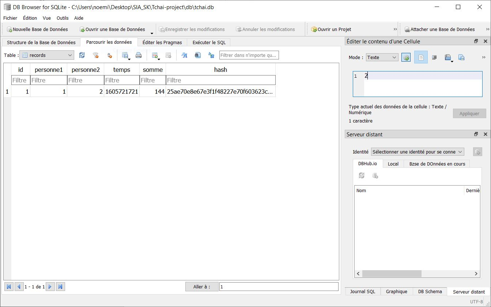
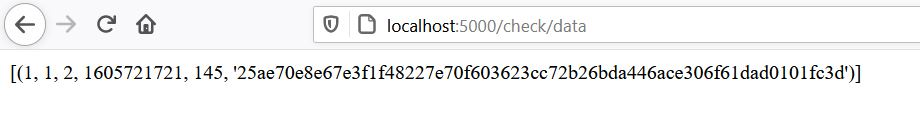
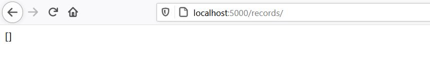
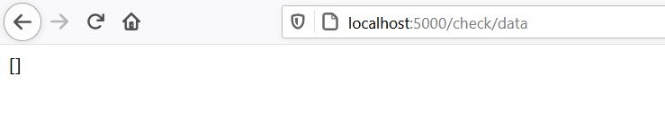
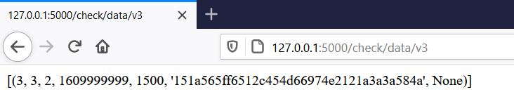

# Tchaï Project

## Usage

### Back

- Executez la commande ```python Tchai.py``` dans un terminal
- Vous pouvez alors accéder à l'adresse ```http://127.0.0.1:5000/``` dans votre navigateur
- Vous pouvez utiliser cette même adresse pour effectuer vos requêtes API.

### Front

Un client développé en Preact est disponible dans le dossier ```front```.

On y accède avec les commandes :
```sh
$ cd front
$ npm install
$ npm run dev
```

L'application est ensuite disponible à l'adresse ```http://127.0.0.1:8080/```

Pour pour de détails, vous pouvez consulter le ```README.md``` disponible dans le dossier ```front```.

## Requêtes API :

Les requêtes créées sont :

### Ajouter une personne

    POST /personne/<nom>/<prenom>
    INSERT INTO personne (nom,prenom) VALUES ("BILLON", "Alexandre")
    
### V4 - Ajouter une personne avec génération de clés RSA

    POST /personne/v4/<nom>/<prenom>
    INSERT INTO personne (nom,prenom) VALUES ("BILLON", "Alexandre")
    INSERT INTO public_key (personne,rsa_pub) VALUES (1, {Clé RSA})

### Supprimer une personne

    DELETE /personne/<id>
    DELETE FROM personne WHERE id=1

### Consulter la liste des personnes

    GET /personnes
    SELECT * FROM personne (ORDER BY nom,prenom)

### Informations d'une personne via son id

    GET /personnes/<id>
    SELECT * FROM personne WHERE id=1

### Effectuer une transaction

    POST /records/<personne1>/<personne2>/<somme>
    INSERT INTO records (personne1,personne2,temps,somme) VALUES (1,2,155615521,1565.54)

### Annuler une transaction

    DELETE /records/<id>
    DELETE FROM records WHERE id=1

### Consulter les transactions dans l'ordre chronologique

    GET /records
    SELECT * FROM records (order by temps ASC)

### Consulter les transactions dans l'ordre chronologique pour une personne

    GET /records/<personne>
    SELECT * FROM records WHERE personne1=1 (order by temps ASC)

### Afficher le solde d'une personne

    GET /solde/<personne>
    SELECT SUM(somme) AS solde FROM records WHERE personne1=1 - SELECT SUM(somme) AS solde FROM records WHERE personne2=1

### Vérifier l'intégrité des enregistrements

    GET /check/data/
    SELECT * FROM records (order by temps ASC)

### Vérifier l'intégrité d'un enregistrement

    GET /check/data/<id>
    SELECT * FROM records WHERE id=1 (order by temps ASC)

### Effectuer une transaction en tenant compte du hash de la plus récente transaction

    POST /records/v3/<personne1>/<personne2>/<somme>
    SELECT id from records WHERE temps = (SELECT MAX(temps) FROM records)

D'autres requêtes pourront être imaginées par la suite.

## Architecture

Le projet se compose de deux fichiers principaux et d'un fichier de base de données :

### Tchai.py

Ce fichier permet de décrire chaque requête API utilisable (ou deprecated) du projet.

### db.py

Ce fichier  contient l'ensemble des fonctions utiles au bon fonctionnement du projet.

C'est notamment ici que l'on intéragit avec la base de données afin d'enregistrer des transactions, vérifier l'intégrité des données, modifier des informations, les afficher, etc.

### Répertoire tests

Ce répertoire contient l'ensemble des scripts permettant de tester l'API, de lancer des attaques, et ainsi comprendre comment réagit le système aux attaques.

### db/tchai.db

Ce fichier correspond à la base de données SQLite utilisée dans le projet. Son architecture est décrite dans la section suivante.

## Database

La base de données est actuellement composée de 2 tables : ```personne``` et ```record```

### Table personne :

```sql
CREATE TABLE "personne" (
	"id"        INTEGER NOT NULL UNIQUE,
	"nom"       TEXT NOT NULL,
	"prenom"    TEXT NOT NULL,
	PRIMARY KEY("id" AUTOINCREMENT)
)
```
- Par la suite, nous pouvons, si nous le souhaitons, ajouter des données supplémentaires à la table personne.

### Table public_key :

```sql
CREATE TABLE "public_key" (
	"id"        INTEGER NOT NULL UNIQUE,
	"personne"  INTEGER NOT NULL,
	"rsa_pub"   TEXT NOT NULL,
	PRIMARY KEY("id" AUTOINCREMENT),
	FOREIGN KEY("personne") REFERENCES "personne"("id"),
)
```

### Table records :

```sql
CREATE TABLE "records" (
	"id"        INTEGER NOT NULL UNIQUE,
	"personne1" INTEGER NOT NULL,
	"personne2" INTEGER NOT NULL,
	"temps"     INTEGER NOT NULL,
	"somme"     NUMERIC NOT NULL,
	"hash"      TEXT NOT NULL,
    "signature" TEXT NOT NULL,
	PRIMARY KEY("id" AUTOINCREMENT),
	FOREIGN KEY("personne1") REFERENCES "personne"("id"),
	FOREIGN KEY("personne2") REFERENCES "personne"("id")
)
```

Le temps est pour l'instant stocké comme étant le nombre de secondes écoulées depuis le 1er janvier 1970. Ce formalisme a plusieurs avantages :
- Il facilite la comparaison de date, puisque ca reviens a faire une differente entre 2 nombres
- Il est géré par la plupars des langage et SGBD
- Il est universel, la notion de fuseaux horaires disparait.

Cependant il est peu compréhensible par l'homme. C'est pourquoi il sera reconverti en date classique lors de l'affichage.

## Tests et attaques

Les tests et attaques sont développés dans le script ```tests/attack.py```

### Test de la modification du fichier de données sans hash v1

Il est possible de modifier le fichier de données à partir de n'importe quelle application de gestion de SQLite :



### Ajout des hash v2

Après l'ajout des hash, si le fichier de données est modifié, lors de la vérification, s'afficheront les transactions dont le hash sauvegardé ne correspond plus avec le hash de la transaction calculé. On détecte donc qu'il y a eu une attaque.



### Suppression d'une transaction dans le fichier de données v2

La suppression d'une transaction est totalement invisible lors de la vérification. Cette attaque peut donner lieu à une double dépense.




### Suppression d'une transaction dans le fichier de données v3

Avec l'implémentation du hash lié au hash précédent, on remarque tout de suite lorsqu'il y a eu une modification sur les transactions.

### Ajout d'une transaction d'une autre personne vers l'attaquant v3
On ajoute une transaction directement dans le fichier de données avec un hash aléatoire. Lors de la vérification, la transaction est incorrecte



Suppression : deprecated for v3 --> 404

## Hash

SHA-256 sera utilisé pour le hashage des enregistrements.

On encode le tuple avec ces informations :

    id_personne1
    id_personne2
    temps
    somme

On crée une chaine ```"{id_personne1}|{id_personne2}|{temps}|{somme}"``` qu'on enverra dans une méthode de hashage SHA-256.

## RSA

A l'ajout d'une nouvelle personne, une paire de clés RSA est générée automatiquement. La clé publique est directement stockée en base, tandis que la clé privée est stockée dans le dossier ```private_key``` sous la forme ```{id_personne}.txt```.

Le stockage de cette clé privée est temporaire, et sera à envoyer à la personne concernée pour utilisation.

## Auteurs

    Alexandre BILLON - alexandre_billon@etu.u-bourgogne.fr
    Noémie CHEVALIER - noemie_chevalier01@etu.u-bourgogne.fr